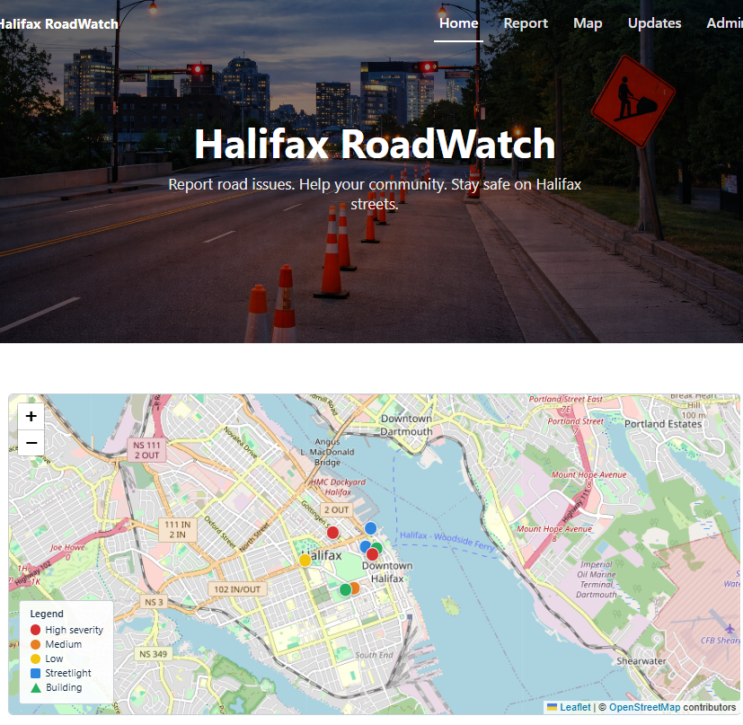
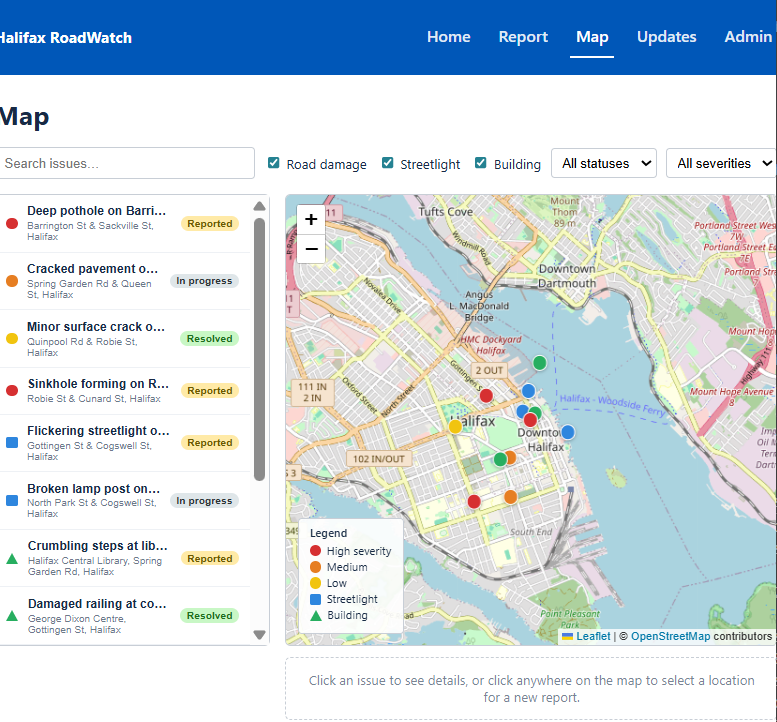
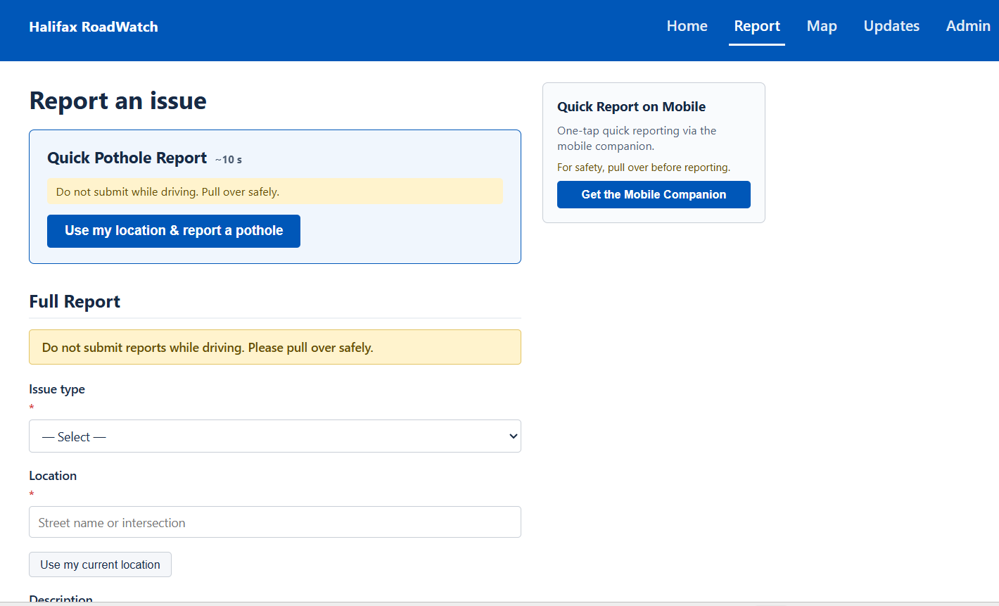

## Halifax RoadWatch is a community-based reporting and road awareness platform. 
Residents can report road damage and public infrastructure issues, while drivers can view existing reports and understand current road risk conditions across the city.

This project is an independent prototype and is not affiliated with the Halifax Regional Municipality.

# Web Demo screenshots

## 1. Home Page

   

## 2. Map Page

   

## 3. Report Page

# Update （2026/02/23）
## Map Page (Leaflet + OpenStreetMap)

The Map page now uses a real interactive map powered by **Leaflet** and **OpenStreetMap** tiles (instead of a static/fake grid).  
This MVP focuses on front-end interactivity and UX, using **local mock data** (no backend yet).

### Key Features
- **Real map tiles (OSM):** Pan/zoom like a real map.
- **Issue markers from local mock data:** Displays 8–12 sample issues around Halifax with:
  - Category: Road damage / Streetlight / Building
  - Status: Reported / In Progress / Resolved
  - Severity: Low / Medium / High
- **Filtering:** Search + category checkboxes + status dropdown + severity dropdown.
- **Click-to-select location:** Click anywhere on the map to drop a temporary pin and preview the coordinates.
- **Selection sync:** Clicking a marker highlights the corresponding item in the left issue list (basic selection state).

### Why local mock data (for now)?
This version is designed as a fast MVP for portfolio/demo:
- No authentication or database required
- Easy to iterate on UI/UX and map interactions first
- Backend + database can be added later (e.g., Admin dashboard, real reports, status workflow)

### Tech Notes
- Map framework: **Leaflet** via **react-leaflet**
- Tile source: **OpenStreetMap**
- Data source: local file `src/data/mockIssues.(ts|js)`

### How to Use (Map)
1. Open `/map`
2. Use the filters to narrow down issues
3. Click an existing marker to view/select that issue
4. Click on the map to place a new location pin and copy/confirm coordinates (MVP: front-end only)

> Future improvement ideas: clustering markers, geocoding address search, “report from my location”, and connecting to a backend API.

> Note: Leaflet requires its CSS to be imported (e.g., in `main.tsx` / `index.js`) for markers and tiles to render correctly.